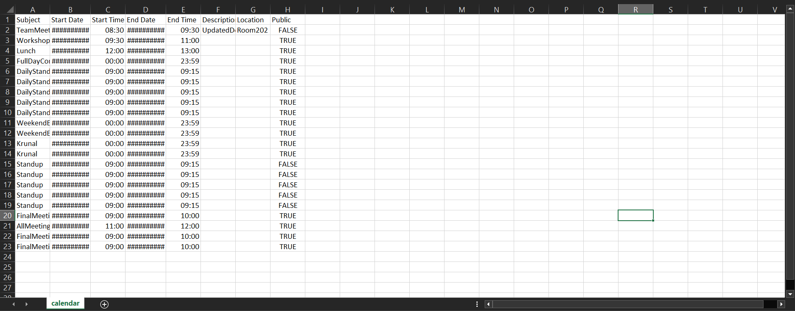

# Virtual Calendar Application

[](https://opensource.org/licenses/MIT)
[](https://www.oracle.com/java/)
[](https://maven.apache.org/)

> **New in Sprint 4:** Java Swing GUI with month view and analytics dashboard, CSV import, and unified controller across CLI, headless, and GUI modes.
> **Full changelog →** [`changelog.md`](changelog.md)

## Overview

This project implements a comprehensive virtual calendar application that mimics the core features of popular calendar software like Google Calendar and iCalendar. Built using Java with Maven, the application follows MVC (Model-View-Controller) architecture and SOLID design principles to ensure maintainability, scalability, and extensibility.

**Sprint 4 Evolution:** Building upon previous iterations, Assignment 6 delivers an intuitive Java Swing GUI with month view, and day dialog. A unified controller now powers CLI, headless scripts, and GUI modes from a single JAR. Additional features include CSV import, and enhanced mutation-tested codebase.

## Visual Demonstrations

### Command Line Interface

*Interactive mode showing various calendar operations and commands*

### Export Functionality

*Calendar export functionality generating CSV files*

### Google Calendar Integration

*Exported calendar data successfully imported into Google Calendar*

### Test Coverage and Quality Assurance

*Comprehensive mutation testing ensuring **89%** test strength, mutation coverage, and line coverage.*

### Graphical User Interface (NEW)

*Month view with calendars and quick-access event dialog*

## Key Features

### **Multi-Calendar Management**
- **Calendar Creation**: Create multiple calendars with unique names and IANA timezones
- **Calendar Selection**: Use `use calendar` command to set active calendar context
- **Calendar Editing**: Modify calendar properties including name and timezone
- **Timezone Migration**: Automatic timezone conversion when editing calendar properties

### **Event Management**
- **Single Events**: Create events with subject, start/end date-time, location, and description
- **Recurring Events**: Create repeating events with flexible scheduling options
- **All-Day Events**: Events with All Day duration
- **Universal Conflict Detection**: Automatic conflict detection enabled by default for all events
- **Event Copy Operations**: Copy events between calendars with automatic timezone conversion

### **Event Editing**
- **SINGLE Mode**: Modify individual event instances
- **FROM Mode**: Modify all events in a series from a specific point forward
- **ALL Mode**: Modify all events with the same subject

### **Query and Search**
- Print events for specific dates or date ranges
- Check calendar availability at specific times

### **Export and Integration**
- Export to CSV format compatible with Google Calendar
- Automatic expansion of recurring events into individual occurrences
- Seamless integration with external calendar applications

### **User Interface**
- **GUI Mode (default)**: Double-click the JAR or run `java -jar Assignment6.jar` to launch the Swing interface.
- **Interactive Mode**: Real-time command input with immediate feedback (`java -jar Assignment6.jar --mode interactive`).
- **Headless Mode**: Batch processing from command files (`java -jar Assignment6.jar --mode headless commands.txt`).

## System Architecture

The application follows the MVC pattern with clear separation of concerns:

### UML Class Diagrams

*Model layer showing event structures and calendar management*


*Controller layer handling business logic and command processing*


*View layer managing user interaction and display*


*Complete system overview showing all components and relationships*

## How to Run the Program

### Prerequisites
- Java JDK 8 or later installed on your system
- Command prompt or terminal
- JUnit 4 for running tests

### Running the Application

The application is now distributed as a compiled JAR file for easy execution:

#### GUI Mode (default)
```bash
java -jar Assignment6.jar
```
Launches the Swing interface.

#### Interactive Mode
```bash
java -jar Assignment6.jar --mode interactive
```

#### Headless Mode
```bash
java -jar Assignment6.jar --mode headless headless.txt
```

### Development Setup (Optional)

For development and testing purposes:

#### Method 1: Using Maven (Recommended)
1. **Build the Project:**
   ```bash
   mvn clean compile
   ```

2. **Run Interactive Mode:**
   ```bash
   mvn exec:java -Dexec.mainClass="view.CalendarApp" -Dexec.args="--mode interactive"
   ```

3. **Run Headless Mode:**
   ```bash
   mvn exec:java -Dexec.mainClass="view.CalendarApp" -Dexec.args="--mode headless path/to/commands.txt"
   ```

## Advanced Features

### Multi-Calendar Operations
- **Calendar Context**: All operations are performed within the context of the active calendar
- **Cross-Calendar Copy**: Copy events between calendars with automatic timezone adjustment
- **Timezone Awareness**: Events maintain their logical time when copied across timezones

### Enhanced Conflict Management
- **Universal Auto-decline**: All events now check for conflicts by default
- **Smart Conflict Resolution**: Improved conflict detection across calendar boundaries

### Recurring Event Patterns
- **Weekday Selection**: Choose specific days (Mon, Tue, Wed, etc.)
- **Count-based**: Repeat for a specified number of occurrences
- **Date-based**: Repeat until a specific end date
- **Individual Editing**: Modify single instances or entire series

### Data Persistence
- **CSV Export**: Google Calendar compatible format
- **Command History**: Track all operations for audit trails
- **Batch Processing**: Execute multiple commands from files

## Testing and Quality Assurance

### Automated CI/CD Pipeline
Our GitHub Actions workflow automatically runs on every push and pull request to the main branch:

- **Unit Tests**: 450+ comprehensive test cases with JUnit 4
- **Code Coverage**: JaCoCo reports with 85%+ line coverage threshold
- **Mutation Testing**: PIT framework ensuring 89% mutation coverage
- **Quality Gates**: Automated coverage thresholds and build validation
- **Artifact Generation**: Automatic JAR builds and test report uploads

### CI/CD Features
- **Parallel Testing**: Fast execution with Maven dependency caching
- **Coverage Reports**: Automated JaCoCo and PIT report generation
- **Quality Enforcement**: Build fails if coverage drops below 85%
- **Artifact Storage**: 30-day retention for test reports, 90-day for JARs
- **PR Integration**: Automatic coverage comments on pull requests

### Running Tests Locally
```bash
mvn clean test                                    # Run unit tests with JaCoCo
mvn jacoco:report                                # Generate coverage report
mvn org.pitest:pitest-maven:mutationCoverage     # Run mutation testing
mvn verify                                       # Run all tests with quality gates
```

### Test Reports Location
- **JaCoCo Coverage**: `target/site/jacoco/index.html`
- **PIT Mutation**: `target/pit-reports/index.html`
- **Surefire Results**: `target/surefire-reports/`

## Features That Work

- **Multi-Calendar Support:**
  - Create multiple calendars with unique names and IANA timezones
  - Switch between calendars using `use calendar` command
  - Edit calendar properties including timezone migration

- **Universal Conflict Detection:**
  - All events automatically check for conflicts without needing --autoDecline flag
  - Enhanced conflict resolution across calendar boundaries

- **Event Copy Operations:**
  - Copy events between calendars with automatic timezone conversion
  - Maintain event integrity across different timezone contexts

- **Single Event Creation:**  
  - Creating single events with optional end date/time
  - Default to all-day events (00:00-23:59) when end time not specified

- **Recurring Event Creation:**  
  - Creating recurring events that repeat on specific weekdays
  - Support for both fixed occurrence count and end date patterns

- **Advanced Event Editing:**  
  - Enhanced editing with SINGLE, FROM, and ALL modes
  - Refactored EditEventOperations for better separation of concerns
  - Global conflict checks ensure edits don't cause overlaps

- **Querying Events:**  
  - Print events on specific dates across active calendar
  - Print events within date/time ranges
  - Check calendar availability at specific times

- **Export to CSV:**  
  - The calendar can be exported to a CSV file.
- **Editing Events:**  
  - Basic editing of events is supported (subject, description, location, start time, and end time).  
  - Supports SINGLE, FROM, and ALL modes for editing.

- **Graphical User Interface:**
  - Month view navigation, day detail pop-ups, drag-to-create events.

- **Import from CSV:**
  - Bulk event import compatible with Google Calendar CSV export.

## Resources and Documentation

- **Complete Documentation**: Available in `/docs` folder (Javadoc generated)
- **Executable JAR**: Ready-to-run application in `/res/Assignment6.jar`
- **Demo Commands**: Demonstration commands in `/res/headless.txt`
- **UML Diagrams**: Complete system architecture in `/res/UML Diagram.pdf`
- **Test Reports**: Mutation testing reports in `/res/pit-reports/`

## Project Links

- **GitHub Repository**: [https://github.com/samyak0510/Calendar/](https://github.com/samyak0510/Calendar/)
- **CI/CD Pipeline**: [GitHub Actions](https://github.com/samyak0510/Calendar/actions)
- **Coverage Reports**: [Codecov Dashboard](https://codecov.io/gh/samyak0510/Calendar)
- **Release Downloads**: [GitHub Releases](https://github.com/samyak0510/Calendar/releases)

## Acknowledgments

This project demonstrates advanced software engineering principles including SOLID design, comprehensive testing, and professional documentation standards. The implementation showcases enterprise-level code quality and architectural decisions suitable for production environments.

**Academic Context**: This was developed as a comprehensive project for the Program Design Paradigm (PDP) course at Northeastern University under Prof. Amit Shesh, evolving through four iterative assignments to demonstrate incremental software development, design pattern implementation, and professional software engineering practices.

Thank you for reviewing our Virtual Calendar Application!
